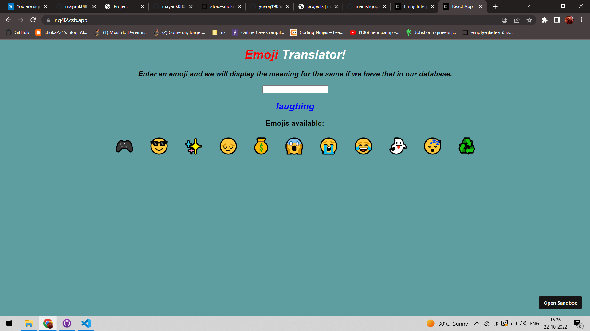

# Emoji-Translator
## About:
1. The application takes input as an emoji from the user and then displays the meaning for the same if we have that in our database.
2. User can also select options present by default by hovering onto them and clicking on the same to have the same information.
3. Created with CodeSandbox
4. Live link is [here](https://codesandbox.io/s/github/mayank0801/Mark-8-Emoji-Translator-updated)

## Tech Stack used:
1. HTML
2. CSS
3. React

